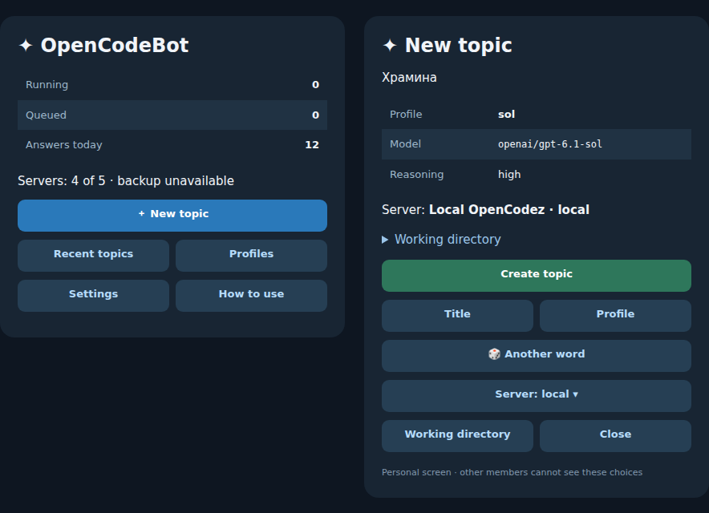

# 🤖 OpenCodeBot

**Run OpenCodez from Telegram. Choose a model, send a task and keep the same session in your web workspace.**

OpenCodeBot turns Telegram forum topics into conversations with your OpenCodez agent. Create topics and profiles in General, send prompts and files from your phone, answer blocking questions, and receive progress and final replies. OpenCodez keeps execution, history and the web workspace.

🇬🇧 [English](README.md) · 🇷🇺 [Русский](README.ru.md) · 📚 [Documentation and languages](docs/README.md) · [Releases](https://github.com/Krablante/opencodebot/releases) · [MIT license](LICENSE)

💬 **Session topics** · 🧰 **Compact progress** · 🎙️ **Optional voice** · 📎 **Artifact delivery**

## 🧭 How it works



*General on the left; topic creation on the right. Preview from the actual menu renderers with sample data; Telegram client layout varies.*

A Telegram topic follows one main OpenCodez session. Assistant text arrives in completed blocks. Economy mode is the default and hides ordinary tool status; `/mode full` enables compact tool status. A saved mode survives restarts and updates. Hidden reasoning, raw tool arguments, and child sessions stay out of the mirror. The bot persists topic bindings, delivery markers, and incoming Telegram receipts so it can recover after a restart. Its `/q` prompt queue remains in memory.

Beyond the mirror, you can enable speech transcription, a separate final-answer voice reply, or an artifact gateway that lets OpenCodez send files to one chosen Telegram topic. These are optional. Remote browser access through WireGuard and a local Telegram Bot API sidecar are optional too.

## 🚀 Start

You need Node.js **22+**, a running OpenCodez server, a Telegram bot token, and your numeric Telegram user ID. Docker Compose is the recommended runtime on Linux, macOS, and Windows; a direct Node.js run also works.

```bash
git clone https://github.com/Krablante/opencodebot.git
cd opencodebot
npm run setup
```

The installer asks for the BotFather token, your user ID, the OpenCodez URL and optional password, then prepares private files, writable paths and Compose mounts. From a container, `127.0.0.1` points at the container; use the host's reachable address or `host.docker.internal`. [First run](docs/en/first-run.md) covers setup and migration; `npm run init-config` remains available for manual configuration.

Start the bot, add it as an administrator to a forum-enabled group, and run `/setup`. It checks rights, preserves or creates FILES and AUDIO, opens General and offers connection setup. Open the bot's private chat once to allow notifications. Groq keys are entered in the same topic where setup requested them. Preferences persist in bot state; routine profile and connection changes need no JSON edits.

The installer creates writable state and records the owner's UID/GID on Linux/macOS. `npm run deploy:bot` requires a **clean Git checkout** and checks the live process after deployment:

```bash
npm run deploy:bot
docker compose logs -f opencodebot
```

For native Node.js, run `npm ci` first, then `npm start`. Do not run it alongside a container polling the same token. [Docker setup](docs/en/docker.md) covers mounts, host paths, the optional local Bot API, and updates; [configuration](docs/en/config-runtime.md) covers runtime files and server settings.

## 💬 Use it

Open the pinned Rich Message menu in General with `/menu`. **New topic** suggests a historical or evocative Russian word with random capitalization and shows the exact model before creation. Choose **Another word** or enter your own title; **Settings → Random topic names** disables the default naming mode. **Profiles** creates and edits presets using the live OpenCodez model catalog. Topic/profile cards are ordinary chat messages with automatic cleanup; the Topic ready confirmation disappears after two minutes, even across a bot restart. `/new` opens the same flow, while `/new [server] [profile] [dir:<path>] [title]` remains a shortcut. The menu moves to a fresh message daily. Bot API 10.3+ is required for Rich Messages and embedded buttons.

In a bound topic, `/q` queues another prompt, `/kill` stops the run, `/reset` starts fresh while preserving the old session, and `/context` exports recent logical turns across compaction. `/export` downloads the current session as one Markdown document: verbatim prompts and final answers, with progress notes at the end only if the latest prompt has no final answer. Reply to an earlier Telegram prompt to rewind that exact OpenCodez turn. **How to use** contains the illustrated guide and downloadable English/Russian PDFs. Working topics have no permanent control panel.

See [Telegram workflow](docs/en/telegram-workflow.md) for topic rules and the full command guide. [Final Voice](docs/en/final-voice.md), [speech and runtime config](docs/en/config-runtime.md#speech-transcription), and [artifact delivery](docs/en/artifact-gateway.md) each have their own setup instructions.

## 🛠️ Operate and develop

`npm run check` checks syntax, `npm run docs:check` validates documentation, `npm test` protects focused contracts, and `npm run smoke` checks integration paths without posting to Telegram. One GitHub Actions job runs these checks for pushes and pull requests. `npm run health:live` checks the deployed process, Telegram and required OpenCodez APIs. Use `npm run deploy:all` for Compose service changes. [Architecture](docs/en/architecture.md), [development](docs/en/development.md) and [updates](docs/en/self-update.md) explain ownership, recovery and the release path.

**Documentation:** [language index](docs/README.md) · 🇬🇧 [English](docs/en/README.md) · 🇷🇺 [Русский](docs/ru/README.md). Every language follows the same topic structure; another language is one directory and navigation update.

The application is MIT licensed; the curated [topic word list](assets/topic-words.LICENSE.md) is CC BY-SA 4.0. OpenCodeBot is an independent companion to [OpenCodez](https://github.com/Krablante/opencodez).
