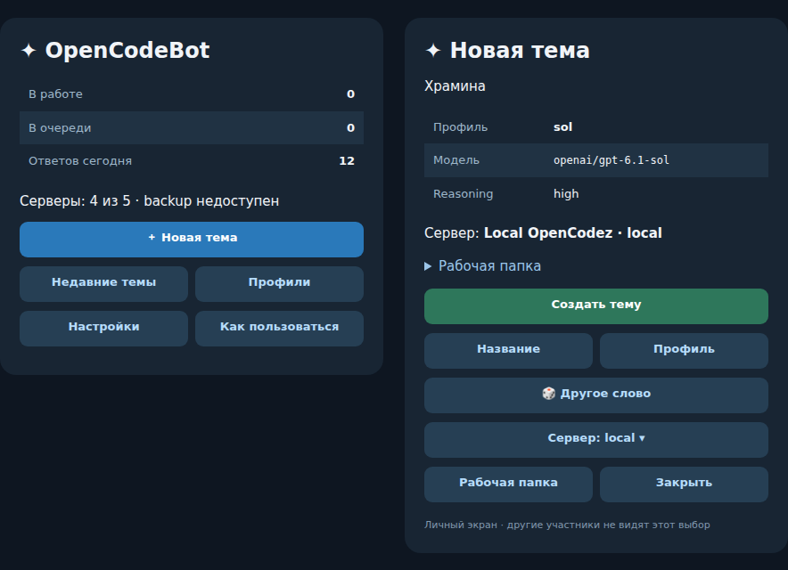

# 🤖 OpenCodeBot

**Управляй OpenCodez из Telegram. Выбери модель, отправь задачу и продолжай ту же сессию в браузере.**

OpenCodeBot превращает темы Telegram-форума в разговоры с агентом OpenCodez. Создавай темы и профили в General, отправляй задачи и файлы с телефона, отвечай на вопросы и получай прогресс и финалы. Выполнение, история и веб-пространство остаются в OpenCodez.

🇷🇺 [Русский](README.ru.md) · 🇬🇧 [English](README.md) · 📚 [Документация и языки](docs/README.md) · [Релизы](https://github.com/Krablante/opencodebot/releases) · [Лицензия MIT](LICENSE)

💬 **Топики сессий** · 🧰 **Короткие статусы** · 🎙️ **Озвучка по выбору** · 📎 **Доставка файлов**

## 🧭 Как это устроено



*Слева General, справа создание темы. Превью настоящих renderers меню с примерными данными; вид зависит от клиента Telegram.*

Один топик соответствует одной основной сессии OpenCodez. Ответы приходят готовыми блоками. По умолчанию экономный режим скрывает обычные статусы инструментов; `/mode full` включает короткие статусы. Сохранённый режим переживает перезапуски и обновления. Скрытые рассуждения, сырые аргументы инструментов и дочерние сессии не попадают в зеркало. Привязки, отметки доставки и входящие обновления Telegram переживают перезапуск. Очередь запросов `/q` живёт только в памяти.

Расшифровку речи, озвучку финального ответа и шлюз для отправки файлов в выбранный топик можно включить отдельно. WireGuard для удалённого браузера и локальный Telegram Bot API тоже необязательны.

## 🚀 Запуск

Нужны Node.js **22+**, работающий сервер OpenCodez, токен бота Telegram и ваш числовой Telegram user ID. Для Linux, macOS и Windows рекомендуем Docker Compose; напрямую через Node.js бот тоже работает.

```bash
git clone https://github.com/Krablante/opencodebot.git
cd opencodebot
npm run setup
```

Установщик спросит токен BotFather, ваш user ID, адрес OpenCodez и необязательный пароль, затем подготовит приватные файлы, папки и Compose mounts. Для контейнера `127.0.0.1` означает сам контейнер: используйте адрес хоста или `host.docker.internal`. [Первый запуск](docs/ru/first-run.md) описывает setup и перенос настроек. `npm run init-config` остаётся способом подготовить конфигурацию вручную.

Запустите бота, добавьте его администратором в группу с темами и выполните `/setup`. Он проверит права, сохранит или создаст FILES и AUDIO, откроет General и предложит подключить функции. Один раз откройте личку с ботом для уведомлений. Ключ Groq вводится в той же теме, где бот его запросил. Обычное редактирование профилей и подключений больше не требует JSON.

Установщик создаёт состояние и записывает UID/GID владельца на Linux/macOS. Развёртывание требует **чистый Git checkout**, помечает образ ревизией и проверяет живой процесс:

```bash
npm run deploy:bot
docker compose logs -f opencodebot
```

Для прямого запуска сначала выполни `npm ci`, затем `npm start`. Не запускай его одновременно с контейнером, опрашивающим тот же токен. [Docker](docs/ru/docker.md) описывает монтирования, пути хоста, локальный Bot API и обновление, а [конфигурация](docs/ru/config-runtime.md) — рабочие файлы и серверы.

## 💬 Работа с ботом

Откройте закреплённое Rich Message меню в General командой `/menu`. **Новая тема** предлагает старинное или образное русское слово со случайным регистром и показывает точную модель перед созданием. **Другое слово** выбирает заново, а **Название** позволяет вписать своё; режим отключается в **Настройки → Случайные названия**. **Профили** позволяет создавать и редактировать настройки по актуальному каталогу OpenCodez. Карточки тем и профилей — обычные сообщения с автоматической очисткой; подтверждение «Тема готова» удаляется через две минуты, в том числе после перезапуска бота. `/new` открывает тот же сценарий, а `/new [server] [profile] [dir:<path>] [title]` остаётся ускорителем. Панель переносится в новое сообщение раз в сутки. Для Rich Messages и встроенных кнопок нужен Bot API 10.3+.

В рабочем топике `/q` ставит запрос в очередь, `/kill` останавливает выполнение, `/reset` сохраняет старую сессию и начинает новую, `/context` выгружает логические ходы с учётом compaction. Ответ на ранний пользовательский запрос откатывает именно тот ход. **Как пользоваться** содержит наглядный гайд и PDF на русском и английском. В рабочих топиках нет постоянной панели управления.

Полные правила и команды собраны в [сценариях Telegram](docs/ru/telegram-workflow.md). У [озвучки](docs/ru/final-voice.md), [расшифровки аудио](docs/ru/config-runtime.md#расшифровка-аудио) и [артефактов](docs/ru/artifact-gateway.md) есть отдельные инструкции.

## 🛠️ Эксплуатация и разработка

`npm run check` проверяет синтаксис, `npm run docs:check` — документацию, `npm test` — важные контракты, `npm run smoke` — интеграционные сценарии без сообщений в Telegram. Одна задача GitHub Actions выполняет эти проверки для push и pull request. `npm run health:live` проверяет действующий процесс, Telegram и обязательные API OpenCodez. Для изменения сервисов Compose есть `npm run deploy:all`. [Архитектура](docs/ru/architecture.md), [разработка](docs/ru/development.md) и [обновления](docs/ru/self-update.md) объясняют владельцев, восстановление и релиз.

**Документация:** [индекс языков](docs/README.md) · 🇷🇺 [Русский](docs/ru/README.md) · 🇬🇧 [English](docs/en/README.md). Во всех языках одинаковая структура тем; новый язык добавляется каталогом и навигацией.

Приложение распространяется под MIT, встроенный [список древнерусских слов](assets/old-russian-words.LICENSE.md) — под CC BY-SA 4.0. OpenCodeBot — самостоятельное дополнение к [OpenCodez](https://github.com/Krablante/opencodez).
